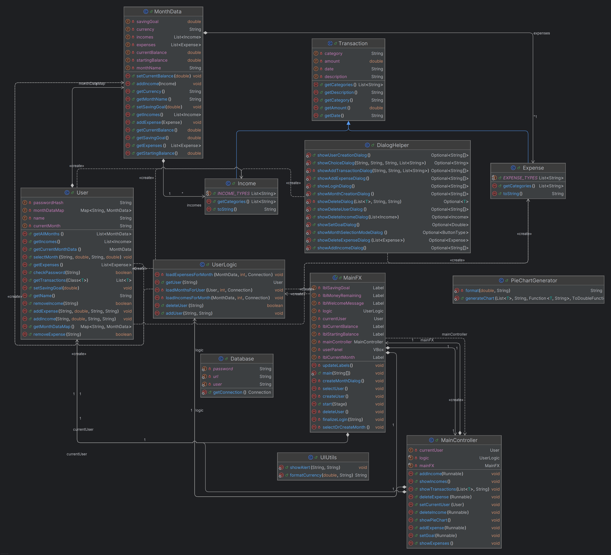
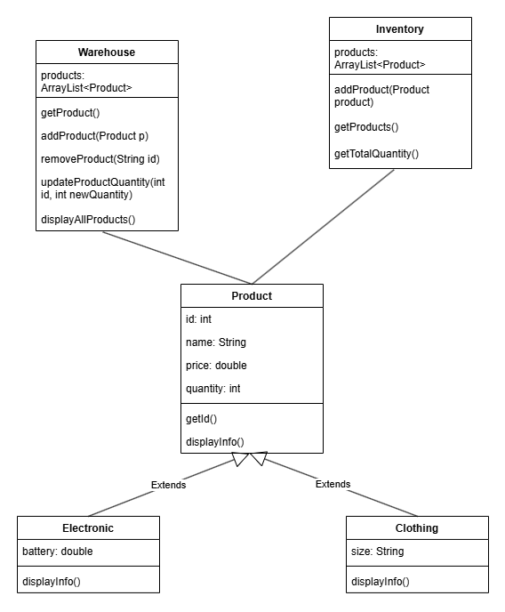

# Welcome to the Learning Outcomes Evaluation

Dear students,

Welcome to this Learning Outcomes Evaluation session. The goal is to assess your understanding and mastery of the learning outcomes for this semester as evidenced by your work that was submitted on your personal git account. Remember to answer each question thoroughly by referencing **Java** code and provide clear explanations where necessary.

Best regards,
Kay Berkling

## Ethics Section regarding generative and other forms of AI

The student acknowledges and agrees that the use of AI is strictly prohibited during this evaluation. By submitting this report, the student affirms that they have completed the form independently and without the assistance of any AI technologies. This agreement serves to ensure the integrity and authenticity of the students work, as well as their understanding of the learning outcomes.

## Checklist before handing in your work

* [ ] Review the assignment requirements to ensure you have completed all the necessary tasks.
* [ ] Double-check your links and make sure that links lead to where you intended. Each answer should have links to work done by you in your own git repository. (Exception is Speed Coding)
* [ ] Make sure you have at least 10 references to your project code (This is important evidence to prove that your project is substantial enough to support the learning outcome of object oriented design and coding within a larger piece of code.)
* [ ] Include comments to explain your referenced code and why it supports the learning outcome.
* [ ] Commit and push this markup file to your personal git repository and hand in the link and a soft-copy via email at the end of the designated time period.

Remember, this checklist is not exhaustive, but it should help you ensure that your work is complete, well-structured, and meets the required standards.

Good luck with your evaluation!

# Project Description (70%)

## Link

https://github.com/dav-lehmann-24/Programming-Project-V2/tree/9daa54ae6123763f778061a364f7f1db3120a8c4/src/main

## TECH STACK

* Java with Gradle
* JavaFX
* Graphic components in JavaFX
* Bcrypt encryption for user authentication
* PostgreSQL database for data storage

## What did you achieve? 

I was able to take my project from the first semester and rethink it completely. I've noticed that it approaches some of the OOP principles already
but not fully. This is why I decided to build the project in a more object-oriented way. I also switched from Java Swing to JavaFX, which is a more
modern framework for building user interfaces in Java. Originally, the data has been stored locally in a JSON file, which I also tried to improve,
by implementing a PostgreSQL database. This ensures that the data is stored in a structured and robust way, and this will also improve the performance and
scalability of the application in the future.

## Learning Outcomes

| Exam Question | Total Achievable Points | Points Reached During Grading |
|---------------|------------------------|-------------------------------|
| Q1. Algorithms    |           4            |                               |
| Q2.Data types    |           4            |                               |
| Q3.Complex Data Structures |  4            |                               |
| Q4.Concepts of OOP |          6            |                               |
| Q5.OO Design     |           6            |                               |
| Q6.Testing       |           3            |                               |
| Q7.Operator/Method Overloading | 6 |                               |
| Q8.Templates/Generics |       4            |                               |
| Q9.Class libraries |          4            |                               |

## Evaluation Questions

Please answer the following questions to the best of your ability to show your understanding of the learning outcomes. Please provide examples from your project code to support your answers.

## Evaluation Material

### Q1. Algorithms

Algorithms are manyfold and Java can be used to program these. Examples are sorting or search strategies but also mathematical calculations. Please refer to **two** areas in either your regular coding practice (for example from Semester 1) or within your project, where you have coded an algorithm. Do not make reference to code written for other classes, like theoretical informatics.

* Sorting: https://github.com/dav-lehmann-24/Programming/blob/5c2841e22d31c8b7b44f9982f901ac7eccb7818e/BubbleSort/BubbleSort.java \
For sorting, I have implemented the Bubble sort algorithm as one of my first searching algorithms. 
* Searching: https://github.com/dav-lehmann-24/Programming/blob/5c2841e22d31c8b7b44f9982f901ac7eccb7818e/BookStream/BookStream.java \
For searching, I made use of a stream to search for books.

| Total Achievable Points | Points Reached During Grading |
|------------------------|-------------------------------|
|                        |                               |
|           4            |                               |

### Q2. Data types

Please explain the concept of data types and provide examples of different data types in Java.
Typical data types in java are int, double, float, char, boolean, long, short, byte, String, and arrays. Please provide one example for each of the **four** following data types in your code.
* arrays
* Strings
* boolean
* your choice

Data types define which value a variable can hold and what operations can be performed on it. In Java, they are divided into primitive data types and reference data types. While primitive data types are predefined by the programing language, reference data types are defined by the user.
* Example for arrays: https://github.com/dav-lehmann-24/Programming/blob/5c2841e22d31c8b7b44f9982f901ac7eccb7818e/ArraySorting/ArraySorting.java (Program sorts an array of integers using a merge sort algorithm)
* Example for Strings: https://github.com/dav-lehmann-24/Programming/blob/5c2841e22d31c8b7b44f9982f901ac7eccb7818e/ProductStream/ProductStream.java (At the end of the program, the output is the category with its sum, where the String gets formatted for the sum)
* Example for boolean: https://github.com/dav-lehmann-24/Programming/blob/5c2841e22d31c8b7b44f9982f901ac7eccb7818e/RockPaperScissor/RockPaperScissor.java (Program runs as long as active_game is true, otherwise it stops)
* Example for char: https://github.com/dav-lehmann-24/Programming/blob/5c2841e22d31c8b7b44f9982f901ac7eccb7818e/SimpleCalculator/Calculator.java (Program reads a char from the user, to decide which operation to perform)

| Total Achievable Points | Points Reached During Grading |
|------------------------|-------------------------------|
|                        |                               |
|           4             |                               |

### Q3. Complex Data Structures

Examples of complex data structures in java are ArrayList, HashMap, HashSet, LinkedList, and TreeMap. Please provide an example of how you have used **two** of these complex data structures in your code and explain why you have chosen these data structures.

* ArrayList: https://github.com/dav-lehmann-24/Programming/blob/5c2841e22d31c8b7b44f9982f901ac7eccb7818e/GradeManager/GradeManager.java \
Here I have used an ArrayList for a GradeManager. I chose this data structure because it is dynamic, as it allows resizing the list as needed,
as well as easy insert and delete operations.
* HashMap: https://github.com/dav-lehmann-24/Programming-2/blob/313ddcda15b5bbc661ca3d372a822c029719f962/GradeManager/src/Student.java \
Here I have used a HashMap to store the grades of a student. I chose this data structure because it allows for fast access to the grades by using the subject as the key. The code mentioned here happened in a speed coding session with Ali, since I don't have another example of a HashMap.

| Total Achievable Points | Points Reached During Grading |
|------------------------|-------------------------------|
|                        |                               |
|           4             |                               |

### Q4. Concepts of OOP
Concepts of OOP are the basic building blocks of object-oriented programming, such as classes, objects, methods, and attributes. 
Explain HOW and WHY your **project** demonstrates the use of OOP by using all of the following concepts:
* Classes/Objects: Each class is a blueprint for creating objects, which are instances of classes. Classes encapsulate data and behavior (encapsulation).
* Methods: Methods are functions defined within a class that operate on the data contained in the class. They define the behavior of objects. If attributes are capsuled, methods are used to access and modify them.
* Attributes: Attributes are variables defined within a class that hold the state or properties of an object. They represent the data associated with an object. In my project, attributes of a Transaction are amount, description, category, and date. \
Link to the code in your project that demonstrates what you have explained above.

* For encapsulation: https://github.com/dav-lehmann-24/Programming-Project-V2/blob/9daa54ae6123763f778061a364f7f1db3120a8c4/src/main/java/dhbw/mosbach/User.java --> The attributes are private (capsuled) and can only be accessed with methods.
* For inheritance: https://github.com/dav-lehmann-24/Programming-Project-V2/blob/9daa54ae6123763f778061a364f7f1db3120a8c4/src/main/java/dhbw/mosbach/Income.java --> Income.java and Expense.java inherit from the abstract Transaction.java class.
* For polymorphism: https://github.com/dav-lehmann-24/Programming-Project-V2/blob/9daa54ae6123763f778061a364f7f1db3120a8c4/src/main/java/dhbw/mosbach/Expense.java --> The method getCategories() is in Transaction abstract, but Expense and Income implement them differently.
* For abstraction: https://github.com/dav-lehmann-24/Programming-Project-V2/blob/9daa54ae6123763f778061a364f7f1db3120a8c4/src/main/java/dhbw/mosbach/Transaction.java --> The Transaction class is abstract, to define attributes and methods for Income and Expense class. \
These are the core principles of OOP and the provided examples prove that I make use of those principles in my project. The classes here are the blueprints for creating objects, and their attributes are capsuled. This means they can only be accessed through methods, which ensures that the data is protected and can only be modified in a controlled way.

| Total Achievable Points | Points Reached During Grading |
|------------------------|-------------------------------|
|                        |                               |
|             6           |                               |

### Q5. OO Design
Please showcase **two** areas where you have used object orientation and explain the advantage that object oriented code brings to the application or the problem that your code is addressing.
Examples in java of good oo design are encapsulation, inheritance, polymorphism, and abstraction. 

* For encapsulation: https://github.com/dav-lehmann-24/Programming-Project-V2/blob/9daa54ae6123763f778061a364f7f1db3120a8c4/src/main/java/dhbw/mosbach/User.java --> The attributes are private (capsuled) and can only be accessed with methods. This ensures that the data is protected and can only be modified in a controlled way.
* For inheritance: https://github.com/dav-lehmann-24/Programming-Project-V2/blob/9daa54ae6123763f778061a364f7f1db3120a8c4/src/main/java/dhbw/mosbach/Income.java --> Income.java and Expense.java inherit from the abstract Transaction.java class. With inheritance, we can reuse code and also avoid code redundancy. This makes the code more maintainable and easier to understand.

| Total Achievable Points | Points Reached During Grading |
|------------------------|-------------------------------|
|                        |                               |
|              6          |                               |

### Q6. Testing
Java code is tested by using JUnit. Please explain how you have used JUnit in your project and provide a link to the code where you have used JUnit. Links do not have to refer to your project and can refer to your practice code. If you tested without JUnit, please explain how you tested your code.
Be detailed about what you are testing and how you argue for your test cases. 

Feel free to refer to the vibe coding session where you explored testing. (pair programming - you may link to your partner git and name him/her.)

Test cases usually cover the following areas:
* boundary cases
* normal cases
* error cases / catching exceptions 

* I created a test unit with Niki, it was created during the vibe coding session and was purely written by AI. However, it didn't work properly, because the AI was hallucinating at some points, which is why I deleted this test and can't show it anymore.

| Total Achievable Points | Points Reached During Grading |
|------------------------|-------------------------------|
|                        |                               |
|         3               |                               |

### Q7. Operator/Method Overloading
An example of operator overloading is the "+" operator that can be used to add two numbers or concatenate two strings. An example of method overloading is having two methods with the same name but different parameters. Please provide an example of how you have used operator or method overloading in your code and explain why you have chosen this method of coding.
The link does not have to be to your project and can be to your practice code.

I haven't implemented an operator or method overloading in my project.

| Total Achievable Points | Points Reached During Grading |
|------------------------|-------------------------------|
|                        |                               |
|          6              |                               |

### Q8. Templates/Generics
Generics in java are used to create classes, interfaces, and methods that operate on objects of specified types. Please provide an example of how you have used generics in your code and explain why you have chosen to use generics. The link does not have to be to your project and can be to your practice code.

https://github.com/dav-lehmann-24/Programming-Project-V2/blob/e8f9b2e2162376a45c3333920154b9373c638d73/src/main/java/dhbw/mosbach/User.java \

public <T extends Transaction> List<T> getTransactions(Class<T> clazz) --> T is a placeholder for the type of Transaction, which allows us to return a list of transactions of a specific type (Income or Expense).

| Total Achievable Points | Points Reached During Grading |
|------------------------|-------------------------------|
|                        |                               |
|           6             |                               |

### Q9. Class Libraries
Examples of class libraries in java are the Java Standard Library, JavaFX, Apache Commons, JUnit, Log4j, Jackson, Guava, Joda-Time, Hibernate, Spring, Maven, and many more. Please provide an example of how you have used a class library in your **project** code and explain why you have chosen to use this class library. 

* https://github.com/dav-lehmann-24/Programming-Project-V2/blob/e8f9b2e2162376a45c3333920154b9373c638d73/src/main/java/dhbw/mosbach/MainFX.java
* Project of semester 1: https://github.com/dav-lehmann-24/Programming-Project/tree/b75e92d5addd1accce5f7aeeb2137ee798933f8a/src \
For my project, I have used the JavaFX library to create a user interface. It is a framework, which allows us to create user interfaces in Java. In the first semester, I used Java Swing, which is also a framework for creating user interfaces in Java, however, JavaFX is more modern and offers additional features like animations and more. This is why I chose to use JavaFX for my project, as it offers a good framework for building user interfaces and it is more powerful than Java Swing.

| Total Achievable Points | Points Reached During Grading |
|------------------------|-------------------------------|
|                        |                               |
|            6            |                               |

# Creativity (10%)
Which one did you choose: 

* [ ] Web Interface with Design
* [X] Database Connected
* [ ] Multithreading
* [ ] File I/O
* [ ] API
* [ ] Deployment

* PostgreSQL database storage: https://github.com/dav-lehmann-24/Programming-Project-V2/blob/9daa54ae6123763f778061a364f7f1db3120a8c4/src/main/java/dhbw/mosbach/Database.java (Connection to database), https://github.com/dav-lehmann-24/Programming-Project-V2/blob/9daa54ae6123763f778061a364f7f1db3120a8c4/src/main/java/dhbw/mosbach/UserLogic.java (Includes queries for the database to e.g. load data) \
* I have chosen to use a PostgreSQL database for my project, as it is a powerful and reliable database management system. Originally, data was stored locally in a JSON file. The database is a good implementation for storing data, as it allows us to store data in a structured way and also allows us to query the data efficiently. This makes the project more robust and scalable for the future.

| Total Achievable Points | Points Reached During Grading |
|------------------------|-------------------------------|
|                        |                               |
|            10          |                               |

# Speed Coding (20%)
Please enter **three** Links to your speed coding session GITs and name your partner. 

* TaskManagementSystem: https://github.com/dav-lehmann-24/Programming-2/tree/313ddcda15b5bbc661ca3d372a822c029719f962/TaskManagementSystem/src (Partner: Niki)
* GradeManager: https://github.com/dav-lehmann-24/Programming-2/tree/359d771d02686ac26df4379e59ec29291d23745d/GradeManager/src (Partner: Ali)
* CarRental: https://github.com/dav-lehmann-24/Programming-2/tree/359d771d02686ac26df4379e59ec29291d23745d/CarRental/src (Partner: Tamino)
* InventoryManagement: https://github.com/dav-lehmann-24/Programming-2/tree/359d771d02686ac26df4379e59ec29291d23745d/InventoryManagement/src (Partner: Beniamin)

Paste your class diagram for your project that you developed during the peer review class here: 

 --> Class diagram of my own project

 --> Class diagram of one of the speed coding sessions (InventoryManagement with Benni)

It can be done very simply by just copying any image and pasting it while editing Readme.md.

| Total Achievable Points | Points Reached During Grading |
|------------------------|-------------------------------|
|                        |                               |
|            16            |                               |

